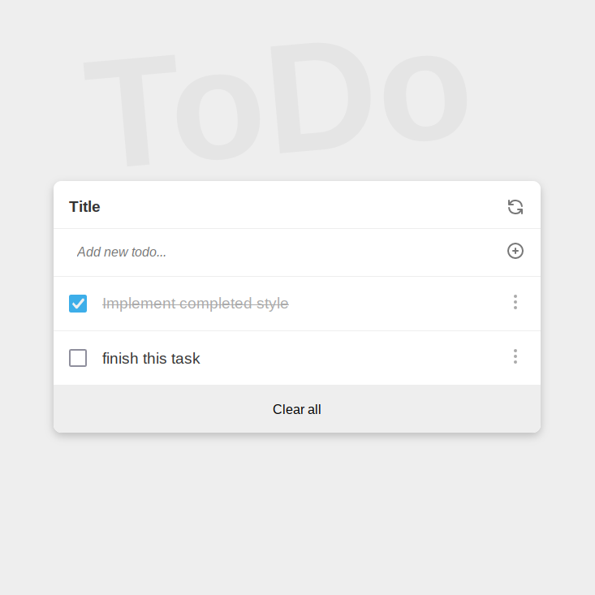

# To Do List (Microverse project)

This is an educational project to make a To Do List web application without using JS frameworks.

## Built With

- HTML5
- JavaScript
- npm
- webpack

## Screenshot



## Usage

To build the project run:

```
$ npm install
$ npm run build
```

## Development

In development environment use the following command:

```
$ npm run dev
```

## Author

👤 **Mostafa Ahangarha**

- GitHub: [@ahangarha](https://github.com/ahangarha)
- Mastodon [@ahangarha@mas.to](https://mas.to/@ahangarha)
- Twitter: [@ahangarha](https://twitter.com/ahangarha)
- LinkedIn: [ahangarha](https://linkedin.com/in/ahangarha)

## 🤝 Contributing

As an educational project at this stage I am not supposed to accept any PR. Yet I appreciate if you can report problems from [issues page](../../issues/).

## Show your support

Give a ⭐️ if you like this project!

## Acknowledgments

- Linters are made by Microverse Inc.

## 📝 License

This project is released under [AGPL](./LICENSE) licensed.
